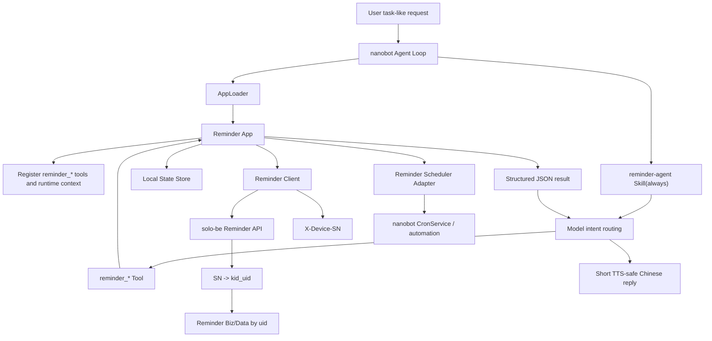
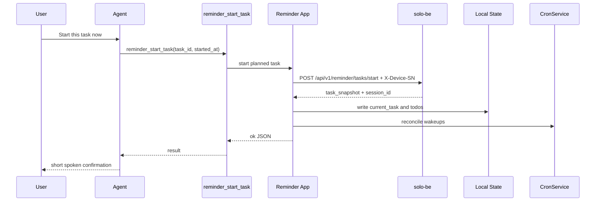
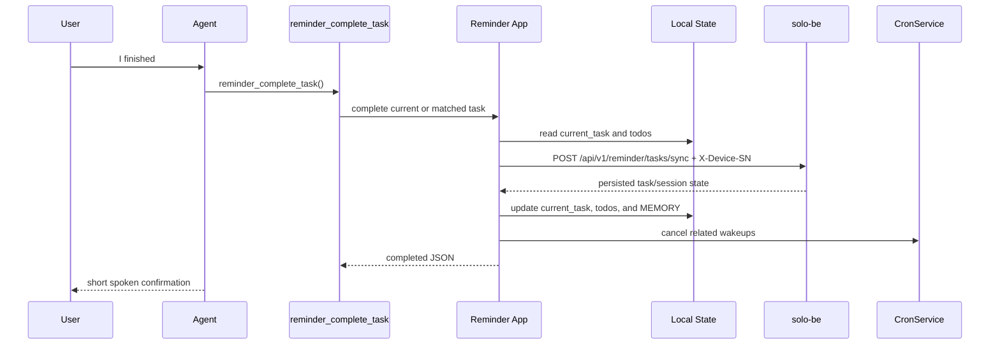
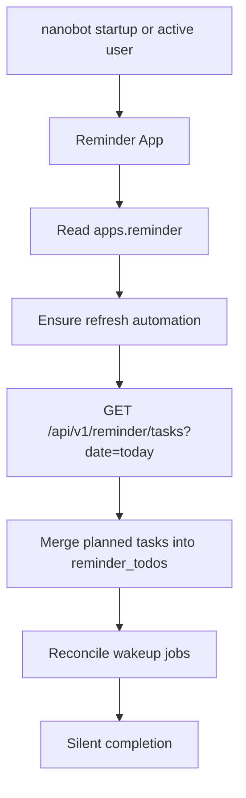

# Reminder App Design

## Goal

Reminder App is the built-in nanobot app that owns task-like user requests:
planned tasks, ad-hoc supervised tasks, one-off reminders, start prompts,
wakeups, completion, deferral, and day-level task queries.

The app preserves the legacy reminder-agent behavior while fitting the current
nanobot app framework:

- `reminder-agent` remains an always-on skill for model routing and TTS-safe replies.
- `Reminder App` owns config, state paths, Reminder Service calls, and scheduling.
- `AppLoader` loads enabled apps from `config.apps`.
- `Reminder App` registers `reminder_*` model-facing tools directly from
  `nanobot.apps.reminder`; no Reminder code lives under `nanobot.agent.tools`.
- The app uses device SN as the device-side identity input. The backend maps
  SN to `kid_uid` and the business/data layers continue to store by `kid_uid`.

## Configuration

The app is configured under root `apps.reminder`.

```json
{
  "apps": {
    "reminder": {
      "enabled": true,
      "baseUrl": "http://127.0.0.1:8090",
      "deviceSn": "DEVICE_SN_001",
      "deviceSecret": "",
      "bearerToken": "",
      "refreshIntervalSeconds": 300,
      "timeoutSeconds": 10,
      "verifySsl": true
    }
  }
}
```

Authentication priority:

```text
bearerToken > X-Device-SN + optional X-Device-Secret
```

`deviceSn` is required for normal device-side operation. `bearerToken` is kept
only as a compatibility/debug path.

## Local Data

Reminder App stores execution-local state in the configured nanobot workspace.
With the current default this is under `~/.nanobot_new/workspace`.

```text
task-planner/current_task.json
task-planner/reminder_todos/YYYY-MM-DD.json
memory/MEMORY.md
```

Data ownership:

```text
current_task.json
  The current supervised task only.

reminder_todos/YYYY-MM-DD.json
  The day-level ledger for planned, ad-hoc, one-off, pending-start, active,
  completed, deferred, and closed reminders.

MEMORY.md / User Reminder State
  Model-visible awareness only. It is not the source of truth.

solo-be PostgreSQL
  Remote source of truth for planned tasks, sessions, events, and messages.
```

## Model-Facing Tool Interface

Query tools:

| Tool | Purpose |
|---|---|
| `reminder_list_todos` | Read local reminder todos for one day. |
| `reminder_refresh_today_todos` | Merge Reminder Service tasks into local todos. |
| `reminder_list_today_tasks` | List Reminder Service tasks for a date. |

Execution tools:

| Tool | Purpose |
|---|---|
| `reminder_start_task` | Start an existing planned task. |
| `reminder_start_ad_hoc_task` | Start a local ad-hoc supervised task. |
| `reminder_sync_current_task` | Sync a full current task payload. |
| `reminder_complete_task` | Complete current or matched task. |
| `reminder_defer_task` | Defer a planned task. |
| `reminder_get_resumable_task` | Find same-day resumable task. |

Scheduling tools:

| Tool | Purpose |
|---|---|
| `reminder_schedule_one_off` | Schedule an independent one-off reminder. |
| `reminder_schedule_start_prompt` | Schedule a future prompt asking whether to start. |
| `schedule_task_wakeup` | Schedule a structured wakeup for the current task. |
| `cancel_task_wakeup` | Cancel a structured wakeup. |
| `list_task_wakeups` | List structured reminder wakeups. |

## Backend API Interface

Reminder App calls the existing Reminder Service endpoints and sends device SN
headers for backend identity resolution.

```http
X-Device-SN: <device_sn>
X-Device-Secret: <optional_device_secret>
```

| Method | Path | Purpose |
|---|---|---|
| `GET` | `/api/v1/reminder/tasks?date=YYYY-MM-DD` | Pull planned tasks. |
| `POST` | `/api/v1/reminder/tasks` | Create planned/ad-hoc task. |
| `POST` | `/api/v1/reminder/tasks/start` | Start planned task. |
| `POST` | `/api/v1/reminder/tasks/sync` | Sync current task payload. |
| `GET` | `/api/v1/reminder/tasks/resumable?date=...&query=...` | Find resumable task. |
| `POST` | `/api/v1/reminder/tasks/defer` | Defer task. |
| `POST` | `/api/v1/reminder/tasks/close` | Close task. |

Backend identity flow:

```text
X-Device-SN
  -> solo-be parent_device lookup
  -> kid_uid
  -> request context uid
  -> Reminder Service / Biz / Data
```

SN and `kid_uid` are one-to-one for MVP. SN is an entry credential; `kid_uid`
remains the business owner for task/session/message rows.

## Scheduling

Reminder App does not implement a separate scheduler. It reuses nanobot's
existing `CronService` / automation runtime and stores Reminder-specific
metadata in cron jobs.

Business job types:

```text
reminder_todos_refresh
reminder_one_off
reminder_scheduled_start
task_wakeup
completion_check
```

Reminder App owns only the business meaning and reconciliation of these jobs.
CronService owns persistence, timing, execution, listing, and removal.

## Request Flow



## Planned Task Start



## Completion



## Background Refresh


